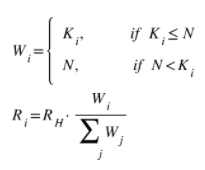

# Architecture

## **Cross-Chain Communication**

A native cross chain communication protocol is developed between BC (Beacon Chain) and BSC (BNB Smart Chain). It has the following key parts:

- Build-in System Contract
- Oracle on Beacon Chain
- BSC Relayer
- BSC Relayer Incentive Mechanism
- Oracle Relayer


### **Architecture Diagram​**

The following diagram depicts the architecture of the cross-transfer mechanism.


## Build-in System Contract

#### **Disclaimer**
​
**The software and related documentation are under active development, all subject to potential future change without notification and not ready for production use. The code and security audit have not been fully completed and are not ready for any bug bounty. We advise you to be careful and experiment on the network at your own risk. Stay safe out there.**


GitHub Implementation link: [https://github.com/bnb-chain/bsc-genesis-contract]("https://github.com/bnb-chain/bsc-genesis-contract")


| Contract Name      | Contract Address                       | ABI file |
| ----------- | ------------------------------------ | ------------------------------------ |
|BSCValidatorSet Contract    |0x0000000000000000000000000000000000001000  | [bscvalidatorset]() |
|Liveness Slash Contract      | 0x0000000000000000000000000000000000001001| [slashindicator]() |
| SystemReward Contract |0x0000000000000000000000000000000000001002 | [systemreward]() | 
| TendermintLightClient Contract   | 0x0000000000000000000000000000000000001003 | [tendermintlightclient]() |
| TokenHub Contract   | 0x0000000000000000000000000000000000001004 | [tokenhub]() |
| RelayerIncentivize Contract   | 0x0000000000000000000000000000000000001005 | [relayerincentivize]() |
| RelayerHub Contract   |0x0000000000000000000000000000000000001006 | [relayerhub]() | 
|GovHub Contract | 0x0000000000000000000000000000000000001007 | [govhub]() |
| TokenManager Contract| 0x0000000000000000000000000000000000001008 | [tokenmanager]() |
|CrossChain Contract  | 0x0000000000000000000000000000000000002000 | [crosschain]() |


### On-Chain Light Client
​
The purpose of cross-chain interoperability is to enable one blockchain to function as a light-client of another. Since Beacon Chain is using a classical Byzantine Fault Tolerant consensus algorithm, light-client verification is cheap and easy: all we have to do is check validator signatures on the latest block, and verify a Merkle proof of the state.

In Tendermint, validators agree on a block before processing it. This means that the signatures and state root for that block aren't included until the next block. Thus, each block contains a field called LastCommit, which contains the votes responsible for committing the previous block, and a field in the block header called AppHash, which refers to the Merkle root hash of the application after processing the transactions from the previous block. So, if we want to verify the AppHash from height H, we need the signatures from LastCommit at height H+1. (And remember that this AppHash only contains the results from all transactions up to and including block H-1)

Unlike Proof-of-Work, the light-client protocol does not need to download and check all the headers in the blockchain - the client can always jump straight to the latest header available, so long as the validator set has not changed much. If the validator set is changing, the client needs to track these changes, which requires downloading headers for each block in which there is a significant change. Here, we will assume the validator set is constant, and postpone handling validator set changes for another time.

Ethereum platform supports stateless precompiled contract implemented with golang and normal contract implemented with solidity. As compared to normal contracts, precompiled contracts are more efficient and costs less gas, but they are stateless. However, on-chain light client must be stateful. So here we will try to a mixed approach: precompiled implemented contract(stateless calculation, such as signature verification) and normal contract (store validator set and trusted appHash).


### Precompile Contract​

**Validate Tendermint Header​**

This contract implements tendermint header verification algorithm. The input parameters contain the trusted consensus state and a new tendermint header. The validation algorithm will verify the new tendermint header against the trusted consensus state. If the new header is valid, a new consensus state will be created and returned to caller. Otherwise, an error will be returned.

**Validate Merkle Proof​**

This contract implements a [Tendermint merkle proof verification algorithm]().

### Solidity Contract
​
**Ten*dermint Light Client Contract​**

1. ConsensusState: The first consensus state will be written in the constructor. Once a new tendermint header is verified, a new consensus state will be created.


type ConsensusState struct {
  chainID              string
  height               int64
  appHash              []byte
  curValidatorSetHash  []byte
  nextValidatorSet     *tmtypes.ValidatorSet
}

2. Tendermint Header: A relayer who want to sync new tendermint headers need to query BC to build this object. Then encode it to byte array and call syncTendermintHeader.

```golang
type Header struct {
    Header blockHeader
    Validator[] CurValidatorSet
    Validator[] NextValidatorSet
}
```
This contract implements the following four methods:

3. function **syncTendermintHeader**(byte[] header, uint64 height)

**syncTendermintHeader** gets nearest consensus state by height and call validateTendermintHeader in precompiled contract to verify the tendermint header. If the success, a new consensus state will be saved.

4. function **getAppHash**(uint64 height) returns(bytes32)

**getAppHash** provides a method to get the verified appHash at the specified height. Besides, If the header of the specified height have not be verified, then zero value will be returned.

5. function **isHeaderSynced**(uint64 height) returns (bool)

**isHeaderSynced** provides a lower cost method to judge if the specified height has been synced.

6. function **getSubmitter**(uint64 height) returns (address)

**getSubmitter** provides a method to get the submitter address of the specified header.

**Merkle Proof Verification Library​**

This library provides an util to verify merkle proof from BC. Contracts which need to verify Merkle proof just need to import this library.

function **verifyMerkleProof**(int64 height, byte[] key, byte[] value, byte[] proof) bool

**verifyMerkleProof** reassembles user parameters and calls the above precompiled contract to validate the proof.

### Other Build-in System Contract​

- **TokenHub Contract**

This contract focuses on cross chain token transfer.

- **TokenManager Contract**

This contract focuses on binding and unbinding tokens on two chains.

- **BSCValidatorSet Contract**

It is a watcher of validators change of BSC on Beacon Chain. It will interact with light client contracts to verify the interchain transaction, and apply the validator set change for BSC. It also stores rewarded gas fee of blocking for validators, and distribute it to validators when receiving cross chain package of validatorSet change.

- **System Reward Contract**

The incentive mechanism for relayers to maintain system contracts. They will get rewards from system reward contract.

- **Liveness Slash Contract**

The liveness of BSC relies on validator set can produce blocks timely when it is their turn. Validators can miss their turns due to any reason. This instability of the operation will hurt the performance of the network and introduce more non-deterministic into the system. This contract responsible for recording the missed blocking metrics of each validator. Once the metrics are above the predefined threshold, the blocking reward for validator will not be relayed to BC for distribution but shared with other better validators.

- **BscValidatorSet Contract**

This contract focuses on handling staking change package from BC. It also provides the validatorset data query for BSC consensus engine.

- **RelayerHub Contract**

This contract manages the authority of bsc-relayer. Someone who wants to run a bsc-relayer must call the contract to deposit some BNB to get the authorization.

- **Governance Contract**

This contract handles the governance package from BC. The governance package contains the target contract address, parameter name and new parameter value. Once the package is verified, this contract will call the parameter update method of the target contract to update the parameter to new value.

- **Cross Chain Contract**

This contract focuses on cross chain packages pretreatment and sending cross chain packages to BC by emit event. The packages pretreatment includes sequence validation and the merkle proof verification. Once they are passed, the package will be routed to application build-in system contract, such as tokenhub or bscvalidator. Besides, if tokenhub or bscvalidator wants to send packages to BC, they need to encode their packages with rlp and call this contract to send them.


## Cross-Chain Transfer Token Transfer

Cross-chain transfers only support bound BEP2 or BEP8 tokens on BC and BEP20 tokens on BSC.

### **Verify Token Info​**
First, you should make sure that it's already bound. For example, you could see the binding info of **BNB**:

      ## mainnet
      bnbcli token info --symbol BNB --trust-node --node http://dataseed4.binance.org:80

      ## testnet
      tbnbcli token info --symbol BNB --trust-node --node http://data-seed-pre-0-s3.binance.org:80
 

  </br>
   
    {
     "type": "bnbchain/Token",
  
     "value": {
  
       "name": "Binance Chain Native Token",
  
       "symbol": "BNB",
  
       "original_symbol": "BNB",
  
       "total_supply": "200000000.00000000",
  
       "owner": "tbnb1l9ffdr8e2pk7h4agvhwcslh2urwpuhqm2u82hy",
  
       "mintable": false,
  
       "contract_address": "0x0000000000000000000000000000000000000000",
  
       "contract_decimals": 18
  
     }
    } 
  
   
As BNB is the native token on both chains, so we use ```0x0000000000000000000000000000000000000000``` as the corresponding contract address. Besides, on BSC, the native token decimals is 18, while the decimals on BC is 8. So if you transfer 1e8:BNB to BSC, the recipient balance will gain 1e18.

### **Transfer BNB from BC to BSC​**

**Example:**  

      ## mainnet
    bnbcli bridge transfer-out --to 0xEe9546E92e6876EdF6a234eFFbD72d75360d91f0 --expire-time 1597543193 --chain-id Binance-Chain-Tigris --from owner --amount 100000000:BNB --node http://dataseed4.binance.org:80

      ## testnet
    tbnbcli bridge transfer-out --to 0xEe9546E92e6876EdF6a234eFFbD72d75360d91f0 --expire-time 1597543193 --chain-id Binance-Chain-Ganges --from owner --amount 100000000:BNB --node http://data-seed-pre-0-s3.binance.org:80

Result:

      Committed at block 465899 (tx hash: 68FFF82197E27A3EC14AFF8C99A035FA9CA7120312AA55E98D11DFC0F8D9F3B9, response: {Code:0 Data:[] Log:Msg 0:  Info: GasWanted:0 GasUsed:0 Events:[{Type: Attributes:[{Key:[84 114 97 110 115 102 101 114 79 117 116 83 101 113 117 101 110 99 101] Value:[49 49] XXX_NoUnkeyedLiteral:{} XXX_unrecognized:[] XXX_sizecache:0} {Key:[69 120 112 105 114 101 84 105 109 101] Value:[49 53 57 55 53 52 51 49 57 51] XXX_NoUnkeyedLiteral:{} XXX_unrecognized:[] XXX_sizecache:0} {Key:[97 99 116 105 111 110] Value:[99 114 111 115 115 84 114 97 110 115 102 101 114 79 117 116] XXX_NoUnkeyedLiteral:{} XXX_unrecognized:[] XXX_sizecache:0}] XXX_NoUnkeyedLiteral:{} XXX_unrecognized:[] XXX_sizecache:0}] Codespace: XXX_NoUnkeyedLiteral:{} XXX_unrecognized:[] XXX_sizecache:0})


### **Transfer BNB from BSC to BC​**

#### **transferOut​**
Call **transferOut** of [TokenHub contract]() in [MyEtherWallet]():


| Parameter Name | Type |	Description |
| ---------------- | ---------------- | ------------------- |
| contractAddr |	address |	for BNB, the value must be 0x0000000000000000000000000000000000000000 |
| recipient |	address |	decode bech32 address, starting with 0x . To transfer to hex string. This is a online too to decode bech32: [https://slowli.github.io/bech32-buffer/]("https://slowli.github.io/bech32-buffer/") |
| amount	| uint256 |	The BNB decimals on BSC is 18. If you want to transfer one BNB, then the value should be 1e18. Besides, the value must be N * 1e10 |
| expireTime |	uint256 |	Timestamp, counted by second |

The value here should follow this equation:

      txValue = (amount + RelayFee)/1e18

```RelayFee``` should be 0.01BNB and it can be updated by on-chain governance. For example, if you transfer 1BNB from BSC to BC, the value should be at least 1.01BNB.

After all the above parameters have been set to proper values, users can click the transact button to build transactions, and metamask plugin will be ejected. Then users can click the confirm button in metamask to sign and broadcast transactions.

#### **batchTransferOutBNB​**

Call **batchTransferOutBNB** of TokenHub contract in MyEtherWallet:


|Parameter Name |	Type |	Description |
|------------ | ------------ | ------------------- |
| recipientAddrs |	address[] |	decode bech32 address to hex string. This is a online too to decode bech32: [https://slowli.github.io/bech32-buffer/0]("https://slowli.github.io/bech32-buffer/0") |
| amounts |	uint256[] |	amount for each recipient, should be N * 1e10 |
|refundAddrs |	address[] |	sender can specify some address as the refund address if the cross chain transfer is failed. |
| expireTime |	uint256 |	Timestamp, counted by second |

The value here should follow this equation:

      txValue = (sumOfAmounts + RelayFee * batchSize)/1e18

### **Transfer BEP2 to BSC​**
Execute the following command to transfer ABC-A64 token to BSC:

      ## mainnet
      bnbcli bridge transfer-out --to 0xEe9546E92e6876EdF6a234eFFbD72d75360d91f0 --expire-time 1597543193 --chain-id Binance-Chain-Tigris --from owner --amount 10000000000:ABC-A64 --node http://dataseed4.binance.org:80

      ## testnet
      tbnbcli bridge transfer-out --to 0xEe9546E92e6876EdF6a234eFFbD72d75360d91f0 --expire-time 1597543193 --chain-id Binance-Chain-Ganges --from owner --amount 10000000000:ABC-A64 --node http://data-seed-pre-0-s3.binance.org:80
      
### **Transfer BEP20 to BC​**

Before calling ***transferOut** or **batchTransferOut**, users need to call **approve** method to grant enough allowance to TokenHub contract. For **transferOut** method, the allowance should equal the transfer amount. For **batchTransferOut**, the allowance should be the sum of the amount array.

#### **transferOut**
​


| Parameter Name |	Type |	Description |
| ------------ | -------------- | ---------- |
| contractAddr	address |	BEP20 contract address |  
| recipient |	address |	decode bech32 address to hex string. This is a online too to decode bech32: [https://slowli.github.io/bech32-buffer/]("https://slowli.github.io/bech32-buffer/") |
| amount |	uint256 |	BEP20 token amount. Here the decimals is 18, so the amount must be N * 1e10. |
| expireTime |	uint256 |	Timestamp, counted by second |

The value here should be RelayFee.

#### **Mint​**
If both the BEP20 token and bep2 token are mintable, then token owners can still mint their tokens even after token binding. Besides, token owners need to ensure the total supply and the locked amount on both chains are still matched, otherwise, users might can’t transfer their tokens to another chain.

**Mint token on BC​**
1. Execute the following command to mint 10000 ABC-A64:
        ## mainnet
        bnbcli token mint --symbol ABC-A64 --amount 1000000000000 --from owner --chain-id Binance-Chain-Tigris --node http://dataseed4.binance.org:80

        ## testnet
        tbnbcli token mint --symbol ABC-A64 --amount 1000000000000 --from owner --chain-id Binance-Chain-Ganges --node http://data-seed-pre-0-s3.binance.org:80

2. Mint token on BSC and lock the new minted token:

- Call **mint** method of BEP20 contract, the mint amount should be 1e22.
Transfer all minted ABC token to tokenHub contract: ```0x0000000000000000000000000000000000001004```

**Mint token on BSC​**
1. Call **mint** of BEP20 contract to mint 10000 ABC, the mint amount should be 1e22(18 decimals).

2. Mint token on BC and lock the new minted token:
- Execute the following command to mint 10000 ABC-A64:

      ## mainnet
      bnbcli token mint --symbol ABC-A64 --amount 1000000000000 --from owner --chain-id Binance-Chain-Tigris --node http://dataseed4.binance.org:80

      ## testnet
      tbnbcli token mint --symbol ABC-A64 --amount 1000000000000 --from owner --chain-id Binance-Chain-Ganges --node http://data-seed-pre-0-s3.binance.org:80

- Transfer all minted ABC-A64 token to the pure-code-controlled address: ```tbnb1v8vkkymvhe2sf7gd2092ujc6hweta38xnc4wpr```(mainnet address: ```bnb1v8vkkymvhe2sf7gd2092ujc6hweta38xadu2pj```)


## BSC Relayer

Relayers are responsible for submitting Cross-Chain Communication Packages between the two blockchains. Due to the heterogeneous parallel chain structure, two different types of Relayers are created.

Relayers for BC-to-BSC communication referred to as **BSC Relayers** are a standalone process that can be run by anyone, and anywhere, except that Relayers must register themselves onto BSC and deposit a certain amount of BNB. Only relaying requests from the registered Relayers will be accepted by BSC.

GitHub Implementation link: [https://github.com/bnb-chain/bsc-relayer]("https://github.com/bnb-chain/bsc-relayer")

Config Files: [https://github.com/bnb-chain/bsc-relayer-config]("https://github.com/bnb-chain/bsc-relayer-config")


### **Monitor and Parse Cross Chain Event​**

As a BSC relayer, it must have proper configurations on the following three items:

| Name | Type |	Description |
| ----------- | ----------- | ---------- |
| srcCrossChainID |	uint16 |	CrossChainID of BC, the value is 1 for testnet |
| destCrossChainID |	uint16 |	CrossChainID of BSC, the value is 96 for testnet |

A BSC relayer is required to parse all block results and pick out all events with event type “IBCPackage” from endBlock event table. This is an cross chain package event example:

    {
      "type": "IBCPackage",
      "attributes":
      [
       {
         "key": "IBCPackageInfo",
         "value": "96::8::19"
        }
      ]
    }

BSC relayer should iterate all the attributes and parse the attribute value:

1. Split the value with “::” and get a 4-length string array
2. Follow the following table to parse the 4 elements:

| Index |	Description |	Type |	Example Value |
| ------ | --------- | --------- | --------------- |
| 0	| CrossChainID  of destination chain |	int16 |	96 |
| 1	| channel id |	int8 |	8 |
| 2 |	sequence |	int64 |	19 |

3. Filter out attributes with mismatched destination chain CrossChainID.

### **Build Tendermint Header and Query Cross Chain Package​**

   **Build Tendermint Header​**

      import tmtypes "github.com/tendermint/tendermint/types"
      type Header struct {
        tmtypes.SignedHeader
        ValidatorSet     *tmtypes.ValidatorSet `json:"validator_set"`
        NextValidatorSet *tmtypes.ValidatorSet `json:"next_validator_set"`
        }

If a cross chain package event is found at height **H**, wait for block **H+1** and call the following rpc methods to build the above **Header** object:


| Name |	Method |
| -------- | -------- |
| tmtypes.SignedHeader |	{rpcEndpoint}/commit?height=H+1 |
| ValidatorSet |	{rpcEndpoint}/validators?height=H+1 |
| NextValidatorSet |	{rpcEndpoint}/validators?height=H+2 |

Header Encoding in golang:

1. Add dependency on [go-amino v0.14.1]()
2. Add dependency on [tendermint v0.32.3]():
3. Example golang code to encode **Header**:

        import (
        amino "github.com/tendermint/go-amino"
        tmtypes "github.com/tendermint/tendermint/types"
          )
        var cdc = amino.NewCodec()
        func init() {
         tmtypes.RegisterBlockAmino(cdc)
        }

        func EncodeHeader(h *Header) ([]byte, error) {
         bz, err := cdc.MarshalBinaryLengthPrefixed(h)
         if err != nil {
        return nil, err
        }
           return bz, nil
        }

### **Query Cross Chain Package With Merkle Proof​** ###

1. Query height: **H**
2. Query path: **/store/ibc/key**
3. Follow the table to build a 14-length byte array as query key:

| Name |	Length |	Value |
| ------ | -------- | ---------- |
| prefix |	1 bytes |	0x00 |
|source chain CrossChainID |	2 bytes |	srcCrossChainID in bsc relayer configuration |
| destination chain CrossChainID |	2 bytes |	destCrossChainID in bsc relayer configuration |
| channelID |	1 bytes |	channelID from event attribute |
| sequence |	8 bytes |	sequence from event attribute |

4. Assemble the above parameters to the following rpc call.
      {rpcEndpoint}/abci_query?path={queryPath}&data={queryKey}&height={queryHeight}&prove=true

### **Call Build-In System Contract​**

#### **Sync BC Header​**

- function **syncTendermintHeader**(bytes calldata header, uint64 height)

  Call **syncTendermintHeader** of TendermintLightClient contract to sync BC header. The contract address is 0x0000000000000000000000000000000000001003. The “header” is the encoding result of **Header** and the height should be **H+1**

#### **Deliver Cross Chain Package​**
Call **handlePackage** of crosschain contract(0x0000000000000000000000000000000000002000) to deliver the cross chain packages:


|Parameter Name |	Type |	Value |
| --------- | ----------- | --------- |
| msgBytes |	[]byte |	package bytes |
| proof |	[]byte |	merkle proof bytes |
| height |	uint64 |	H+1 |
| packageSequence |	uint64 |	sequence from attribution value |
| channelId |	uint64 |	channle id |


## Incentive Mechanism for BSC Relayer

The BSC relayers play an important role in relaying interchain packages from BC to BSC. All BSC relayers build their stable infrastructure, watch any event happened on the Beacon Chain, and act timely to get paid accordingly. The following discussion is about how to distribute the rewards to let the relayers are willing to make a long-term contribution.

### **Principle​**

Considering the following points:

  1. Fairness, competitiveness, and redundancy: Everyone has a chance to run a relayer even on cheap hardware. It should be hard for someone to get all the rewards.
  2. Simplicity.
  3. Robustness: The relayer may have a strategy to make its largest profit accordingly, under any condition, the interchain communication should not be blocked.
  4. Low Risk: The relayer should take a little risk to play in this game. For the top N relayers, they should gain enough rewards to cover the cost.

It is tough hard to achieve all these goals; we make some trade-off on robustness and low risk in the following design.

### **Rewards Source and Allocation​**

We have three reward sources:

1. Users paid rewards: Users who send ``bind`` or ``cross chain transfer`` transactions need to pay extra fee as BSC relayer rewards.
2. System rewards: Rewards comes from ``SystemReward`` contract.

The role of relayers and their rewards comes from:

| Relayer Behavior |	Rewards come from |
| -------------- | -------------------- |
| User packages(bind, unbind, transfer) from BC to BSC |	Users pay for the reward |
| System packages(staking, slash, governance) from BC to BSC |	System reward |
| Relayer for sync tendermint header to light client contract |	System reward |

### **Rewards Distribution Formula​**

To prevent the relayer who has the best network always winning the game, we gather the reward into two reward pools (header relayer reward pool and package relayer reward pool) and reallocate to the relayers to achieve redundancy:

  1. S is a constant number of transactions that in around. Each round, there are S transactions, and the last transaction of the round will trigger reward distribution.
  2. N is the maximum weight that a relayer can gain in a round. R is the total reward in this round. Ki is the number of successful transactions from Relayer i. Wi is the reward weight of Relayer i. Ri is the rewards of Relayer i.
  3. R is the total reward in this round.
  4. Ki is the number of successful transactions from Relayer i.
  5. Wi is the reward weight of Relayer i.
  6. Ri is the rewards of Relayer i.

#### **Weight formula for package relayers:​**


``Rp`` represents the total balance of package reward pool.

#### **Weight formula for header relayers:​**



``Rh`` represents the total balance of header reward pool.

 **We consider setting these parameters a reasonable value:**
 ​
  1. S to be 100. Some rewards come from gas fee, we can not guarantee enough rewards during a small round, a large round may dismiss deviation and let relayer give up relaying when it has made its max profit.
  2. N to be 40. We think the redundancy of relayer around 3-5 is best. If N is too large, the redundancy will decrease. If N is too small, then there will not be enough relayers. Set N as 40 may be a reasonable value, at least 3 relayers can compete.
  3. The relayFee of a single package and the ratio of reward for header relayer can be modified by governance on Beacon Chain.

  **Distribution And Claim Reward​**

In each round, the last package delivery transaction will trigger the reward distribution. Both the header reward pool and package reward pool will be distributed. However, the reward won't be paid directly to relayer accounts. The distribution algorithm just calculates rewards for all relayers and writes down the amounts. Relayers are required to actively send transactions to claim their own accumulated rewards.

### **Other Consideration​**
**System Reward Pool​**

The system reward pool can hold at most 100BNB for example, to prevent the pool get unnecessary income.

The client needs to query the balance of the contract to decide whether to distribute 1/16 of the transaction fee to the contract or not. It seems not that fair that some validators pay more to the reward pool than others, but this is random and will eventually become fair in the long run.

If there are not enough rewards in the pool, all the tokens in the pool will be distributed.

Block header sync transaction with validatorSet change will claim reward to relayers from system reward pool directly.

**Foul Play​**

For example, a relayer may deliver packages using a different address in round robin, we can’t recognize this. We try to introduce registration and BNB deposit for relayer to raise the cost of cheat. How it works:

  - A BSC account needs to call the ``register`` of [RelayerHub]() contract to deposit 100BNB(more or less than 100 BNB will be rejected) to become a BSC relayer.
  - Only a valid relayer can sync Beacon Chain Headers and deliver cross-chain packages.
  - Relayer can withdraw its deposit, but we will charge 0.1 BNB as the transaction fee so that it will receive 99.9 BNB back.
  - The charged fee will directly go to the system reward pool.


## Oracle Module

The **oracle** module is a common module like gov which is used to handle prophecy and claim. Prophecy means the validators want to reach a consensus on something, like cross chain transfer. Claim is raised by a validator and the content of claim is the cross chain transfer. When most of the validators (like 70%) claim the same thing on the prophecy, the winning claim will be executed.For oracle module is a common module, other module which depends on oracle module will register claim type and related hooks checking and handling claim. Each claim type has a sequence, oracle module should process prophecy and claim by sequence. When one prophecy is executed successfully, the sequence of the claim type will be increased by one.

### **Oracle Process​**

  1. Oracle module receives a claim message from validator, if the sequence is not current sequence, the claim message will be rejected.
  2. If sequence is valid, the hooks of the claim type will check the claim message, if the claim message is invalid, then return
  3. If the claim message is valid and it’s the first claim, the related prophecy will be created. If claim message is not the first claim, then it will be added to the existed prophecy.
  4. If the power of validators which claim the same content reaches a threshold like 70%, the prophecy will be marked success and the hooks will execute the winning claim and the sequence of claim type will be increased.
  5. If there is no chance that the validators will reach a consensus, the prophecy will be marked failed and the prophecy will be deleted and the validators should start over again.


### **Bridge Module​**

Bridge module will process cross chain transactions. It contains two parts: transactions from BC to BSC and transactions from BSC to BC. For transactions from BSC to BC, it will depend on the oracle module. When the validators reach a consensus on a certain claim, the bridge module will process the transaction according to the claim, like transfer from BSC to BC. For transactions from BC to BSC, it will process the BC part of the transaction and write the related cross chain package for BSC.


## Oracle Relayer

The relayer is a service which monitors events on BSC, builds and broadcasts transactions to BC. Each validator operator should maintain its own relayer service. The relayer service requires to have access to the validator operator private key. All relayer service independently witness the peggy contract events, then build transactions to claim events to BC oracle module.

The relay process:

  - Continually listen for cross chain event
  - Parse the cross-chain transfer parameters from event data
  - Use this information to build an unsigned BC oracle transaction
  - Sign and broadcast transaction.
GitHub Implementation link: [https://github.com/bnb-chain/oracle-relayer]("https://github.com/bnb-chain/oracle-relayer")